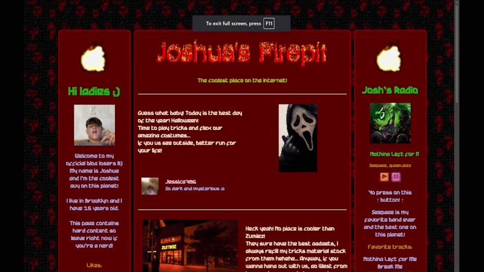

# Joshua’s Firepit

## Preview

<p align="center">
  
</p>

## Description

Joshua’s Firepit is an OSINT CTF challenge created for the WhiteOps x CLE event. It presents itself as a simple, old-school website, intentionally minimal and slightly unconventional in structure and design.

The objective is to analyze the content of the site, with particular attention to a specific image left by “Joshua.” By following the information embedded in or around that image, participants are expected to identify the exact real-world address where he is supposedly hiding.

The final answer is not entered directly as text, but corresponds to a file. The challenge relies on observation, basic OSINT techniques, and careful inspection of available resources.

## Usage

```bash
git clone https://github.com/ZyadSerghini/joshuas-firepit.git
cd joshuas-firepit
```

Open the files in a browser and begin investigating.
