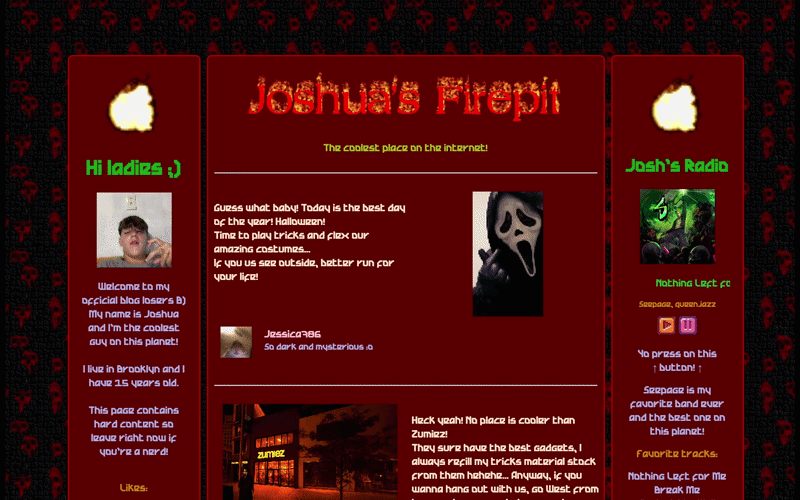

# 🔥 Joshua’s Firepit 🔥

  

## 📄 Description

Joshua’s Firepit is an OSINT CTF challenge created for the WhiteOps x CLE Halloween event. It presents itself as a simple, old-school website, intentionally minimal and slightly unconventional in structure and design.

I made this challenge as a tribute to the indie web that is dear to my heart. Main inspiration was Hypnospace Outlaw (especially Zane's website).

## 🎯 Your objective

"Joshua", a bratty teenager is out on Halloween with his friends causing trouble and playing tricks on everyone. Time for you to put him in their place and teach him a lesson.

Find the exact address where he's hiding, that we'll show him what not to put publicly on the internet. There should be enough information on his blog for you to figure out.

## 🌟 Solution

    

        <strong>Reveal solution</strong>
    
 

    142 PIERREPONT STREET
    

